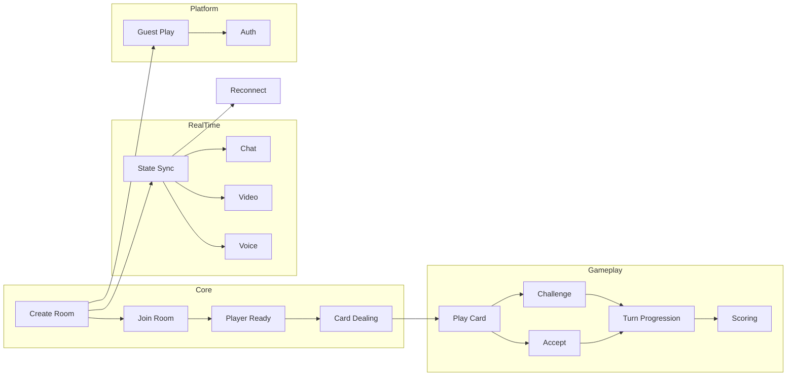

# PRD: Sweet & Spicy - Multiplayer Card Game

> Product Requirements Document for Sweet & Spicy Online Card Game
> Status: Draft | Version: 1.0 | Date: 2026-03-18 | Author: Development Team

---

## 1. Executive Summary

Sweet & Spicy is a real-time multiplayer online bluffing card game where 2-6 players compete to be the first to empty their hand. Players play cards face-down, declare their card's value and suit, and can either tell the truth or bluff. Other players may challenge declarations - if a bluff is caught, the bluffer draws penalty cards; if the declaration was true, the challenger draws penalty cards.

The game combines strategic deception, risk assessment, and social interaction through integrated chat and video/voice communication, creating an engaging online gaming experience similar to classic party games like "I Doubt It" or "Cheat".

---

## 2. Business Context

### 2.1 Problem Statement

**Current State:**
- Physical card games require players to be in the same location
- Existing online versions lack real-time communication (video/voice)
- Most digital card games focus on strategy rather than social bluffing
- Limited options for casual, quick games (15-20 minutes) with friends

**Pain Points:**
- Friends and family cannot easily play card games remotely
- Existing apps lack integrated video communication
- Games are either too complex (hours) or too simple (no strategy)
- No platform combines casual gameplay with social interaction

**Why Now:**
- Remote social gaming demand increased post-pandemic
- WebRTC technology enables peer-to-peer video at low cost
- Mobile-first gaming is the dominant platform
- Real-timeSocket.IO technology is mature and reliable

### 2.2 Strategic Alignment

**Business Goals:**
1. **User Acquisition**: Capture casual gamers seeking quick, social gameplay
2. **Retention**: Build community through voice/video interaction
3. **Monetization** (Future): Cosmetic items, premium rooms, subscriptions

**Target Outcomes:**
- 10,000 active monthly users within 6 months
- Average session duration: 20+ minutes
- 70% of games include voice/video usage
- Network effect: each new user brings 2-3 additional players

**Competitive Advantage:**
- First-mover in "bluffing card game + video chat" combination
- Kid-friendly (8+) broadens family gaming market
- Simple rules, deep strategy appeal to casual and hardcore gamers
- Cross-platform (web, mobile-ready PWA)

### 2.3 Success Metrics (KPIs)

| Metric | Baseline | Target | Timeline |
|--------|----------|--------|----------|
| Monthly Active Users | 0 | 10,000 | 6 months |
| Average Game Duration | - | 15-20 min | Launch |
| Daily Games Played | 0 | 5,000 | 3 months |
| Voice/Video Usage Rate | - | 70% | 3 months |
| User Retention (D7) | - | 40% | 3 months |
| App Store Rating | - | 4.5+ | 6 months |

### 2.4 Competitive Context

**Competitors:**
| Competitor | Strength | Weakness |
|------------|----------|----------|
| Tabletop Simulator | Multi-game, realistic | No specific game focus, paid |
| Board Game Arena | Tournament structure | No video, complex UI |
| Among Us | Social deception | Not card-game based |
| Hackathon Game | Real-time | Limited features |

**Our Differentiation:**
- Focused game: only Sweet & Spicy, optimized experience
- Integrated video/voice from day one
- Kid-friendly (8+) vs competitor 13+
- Free-to-play with cosmetic monetization

---

## 3. User Personas

### 3.1 Persona 1: Family Gamer - Minh

**Profile:**
- **Name**: Minh, 35 years old
- **Role**: Parent, works as accountant
- **Tech Proficiency**: Medium - uses smartphone daily, plays casual games

**Goals:**
- Play quick games with family members remotely
- Introduce card games to children in a fun way
- Have quality time with kids through gaming

**Pain Points:**
- Existing games are too complex for 8-year-old children
- Hard to coordinate family game nights with relatives in different locations
- Children lose interest quickly if game is too slow

**Success Criteria:**
- Can start a game room and invite family via link
- Children can understand game rules within 2 minutes
- Video call works reliably for 4+ players

**User Journey:**
1. Opens app → Sees "Create Room" button
2. Creates room → Shares room code with family
3. Waits for players → Sees family faces via video
4. Plays game → Children understand when to challenge
5. Game ends → Sees scores, ready for next round

---

### 3.2 Persona 2: College Student - Linh

**Profile:**
- **Name**: Linh, 20 years old
- **Role**: University student, studies business
- **Tech Proficiency**: High - always online, gaming enthusiast

**Goals:**
- Play quick games between study sessions
- Socialize with friends remotely
- Find new friends with similar interests

**Pain Points:**
- Games are too time-consuming (MMO, RPG)
- Can't use voice chat in most online games
- Hard to convince friends to try new games

**Success Criteria:**
- Can create room and start game in under 30 seconds
- Voice chat has minimal latency
- Can add reactions/emoji during game

**User Journey:**
1. Opens app → Quick login (guest or social)
2. Creates room → Customizes room settings
3. Shares link → Friends join instantly
4. Enables voice → Talks while playing
5. Wins game → Shares result to social

---

### 3.3 Persona 3: Competitive Player - Khanh

**Profile:**
- **Name**: Khanh, 25 years old
- **Role**: Software developer, esports enthusiast
- **Tech Proficiency**: Very High - builds own PC, follows gaming trends

**Goals:**
- Master the art of bluffing and detection
- Compete in ranked matches
- Analyze gameplay to improve strategy

**Pain Points:**
- Casual games lack competitive depth
- No ranking or skill rating system
- Can't watch replays or analyze games

**Success Criteria:**
- Ranked matchmaking works fairly
- Can view game statistics and history
- Leaderboards show top players

**User Journey:**
1. Logs in → Selects "Ranked" mode
2. Gets matched → Against similar skill players
3. Plays game → Uses advanced bluffing strategies
4. Wins → Gains rating points
5. Reviews game → Studies mistakes and wins

---

### 3.4 Persona 4: International User - Yuki

**Profile:**
- **Name**: Yuki, 28 years old
- **Role**: Digital nomad, travels Asia
- **Tech Proficiency**: High - mobile-first user

**Goals:**
- Find English-speaking players worldwide
- Play on mobile while traveling
- Connect with people from different cultures

**Pain Points:**
- Language barriers in most gaming platforms
- Mobile versions lack features of desktop
- Unstable connections in remote areas

**Success Criteria:**
- Works on mobile with touch controls
- Game state syncs reliably on slow connections
- Translation/localization available

**User Journey:**
1. Opens mobile app → Selects language
2. Joins public room → Meets international players
3. Uses chat → Communicates in English
4. Has fun → Adds friends from different countries

---

## 4. Use Cases

### UC-001: Create and Join Game Room

**Actor**: Any User (Minh, Linh, Khanh, Yuki)
**Precondition**: User has opened the application
**Main Flow**:
1. User clicks "Create Room" button
2. System generates unique 4-character room code
3. User can share room code via link, copy, or QR
4. Other users enter code or click shared link
5. System validates room exists and is not full
6. User joins room and appears in player list

**Alternative Flows**:
- A1. User joins via shared link → Code auto-fills → Direct join
- A2. User enters invalid code → Error message → Retry option

**Postcondition**: User is in room, can see other players, and can ready up

**Exception Flows**:
- E1. Room is full (6 players) → "Room is full" error
- E2. Room doesn't exist → "Room not found" error
- E3. Game already started → "Game in progress" error

---

### UC-002: Start Game with Minimum Players

**Actor**: Room Host
**Precondition**: At least 2 players in room, all players ready
**Main Flow**:
1. Host clicks "Start Game" button
2. System validates all players ready (minimum 2)
3. System shuffles deck and deals 5 cards to each player
4. System randomly selects first player
5. System transitions game to PLAYER_TURN phase

**Alternative Flows**:
- A1. Not enough players → "Need at least 2 players" message

**Postcondition**: All players have 5 cards, first player can act

**Exception Flows**:
- E1. Player disconnects before start → Game doesn't start
- E2. Deck corruption → Reshuffle and restart

---

### UC-003: Play a Card with Declaration

**Actor**: Current Player
**Precondition**: It's player's turn, game in PLAYER_TURN phase
**Main Flow**:
1. Player selects a card from hand
2. Player declares (selects) spice type and number
3. Player clicks "Play" to confirm
4. System validates card is in hand
5. System moves card from hand to played area (face-down)
6. System transitions game to CHALLENGE_PHASE

**Alternative Flows**:
- A1. Player selects no card → "Select a card" prompt
- A2. Player wants to pass → Can skip playing (limit 3 passes per game?)

**Postcondition**: Card is played face-down, other players can challenge

**Exception Flows**:
- E1. Card not in hand → Error, selection reset
- E2. Turn timeout → Auto-pass after 30 seconds

---

### UC-004: Challenge a Player's Declaration

**Actor**: Any Non-Playing Player
**Precondition**: Game in CHALLENGE_PHASE, challenge window open
**Main Flow**:
1. Player clicks "Challenge" button
2. System records challenger ID
3. System reveals played card
4. System compares actual card vs declaration
5. If mismatch (bluff):Bluffer draws 2 penalty cards, Challenger scores +1
6. If match (truth): Challenger draws 2 penalty cards, Bluffer scores +1
7. System transitions to PENALTY phase

**Alternative Flows**:
- A1. No challenge within 5 seconds → Declaration accepted
- A2. Player is the one who played → Cannot challenge self

**Postcondition**: Penalty cards dealt, scores updated

**Exception Flows**:
- E1. No cards left in draw pile → Shuffle played cards (except last)
- E2. Super-Joker played → Cannot be challenged, always wins

---

### UC-005: Accept Declaration Without Challenge

**Actor**: All Non-Playing Players
**Precondition**: Game in CHALLENGE_PHASE
**Main Flow**:
1. Challenge window timer counts down (5 seconds)
2. No player challenges
3. System accepts declaration automatically
4. Player who played card scores +1 (successful bluff)
5. System transitions to NEXT_TURN phase

**Alternative Flows**:
- A1. Player clicks "Accept" early → Immediate acceptance

**Postcondition**: Scores updated, turn passes to next player

---

### UC-006: End Game and Determine Winner

**Actor**: System (automatic)
**Precondition**: A player empties hand OR draw pile exhausted
**Main Flow**:
1. System detects end condition triggered
2. For each player still holding cards:
   - Add bonus +3 points if hand is empty
   - Subtract -1 point per remaining card
3. Calculate final scores for all players
4. Identify player with highest score as winner
5. Display winner announcement with final scores
6. Show "Play Again" option

**Alternative Flows**:
- A1. Tie → All tied players share victory

**Postcondition**: Game ends, scores final, room returns to lobby

---

### UC-007: Real-Time Game State Synchronization

**Actor**: System (Socket.IO)
**Precondition**: Players connected via Socket.IO
**Main Flow**:
1. Any player action triggers state change
2. Server broadcasts new game state to all players
3. All clients update UI to reflect new state
4. Players see consistent game view

**Alternative Flows**:
- A1. Player reconnection → Full state sync from server
- A2. Network lag → Optimistic updates with server reconciliation

**Postcondition**: All players see identical game state

---

### UC-008: In-Game Text Chat

**Actor**: Any Player
**Precondition**: Player in game room (any phase)
**Main Flow**:
1. Player types message in chat input
2. Player presses Enter or clicks Send
3. System broadcasts message to all room players
4. All players see message in chat panel
5. Message appears with timestamp and player name

**Alternative Flows**:
- A1. Empty message → Not sent
- A2. Message too long (>200 chars) → Truncation warning

**Postcondition**: Message visible to all room members

---

### UC-009: Video/Voice Communication

**Actor**: Any Player
**Precondition**: Player grants camera/microphone permissions
**Main Flow**:
1. Player clicks "Enable Video" or "Enable Voice"
2. System requests media permissions
3. Player grants permission
4. Stream starts for other players to see/hear
5. Other players see video thumbnail and hear audio

**Alternative Flows**:
- A1. Permission denied → Voice-only mode or text only
- A2. Poor connection → Auto-reduce quality

**Postcondition**: Media stream active for room participants

---

### UC-010: User Authentication and Profile

**Actor**: New/Returning User
**Precondition**: User opens application
**Main Flow**:
1. New user sees welcome screen
2. User enters nickname (3-15 characters)
3. User optionally logs in via social (Google, Facebook)
4. System creates/retrieves user profile
5. User sees main menu

**Alternative Flows**:
- A1. Guest play → Anonymous ID generated
- A2. Returning user → Auto-login if token valid

**Postcondition**: User authenticated, profile stored

---

## 5. Functional Requirements

### Epic 1: Room Management

#### FR-001: Create Game Room
As a **player**, I want to **create a game room and get a shareable code**, so that **I can invite friends to play**.

**Acceptance Criteria:**
- Given I'm on the home screen, When I click "Create Room", Then a unique 4-character room code is generated and displayed
- Given a room is created, When I share the code/link, Then other players can join using that code
- Given the room is created, When I leave without starting, Then the room is destroyed after 5 minutes of inactivity

**Priority**: Must | **Complexity**: S | **Related Use Cases**: UC-001

#### FR-002: Join Existing Room
As a **player**, I want to **join an existing room using a code**, so that **I can play with friends**.

**Acceptance Criteria:**
- Given I'm on the home screen, When I enter a valid room code, Then I join the room and appear in the player list
- Given I enter an invalid code, When I try to join, Then an error message shows "Room not found"
- Given a room is full (6 players), When I try to join, Then an error shows "Room is full"

**Priority**: Must | **Complexity**: S | **Related Use Cases**: UC-001

#### FR-003: Player Readiness
As a **player**, I want to **mark myself as ready**, so that **the game can start when all players are ready**.

**Acceptance Criteria:**
- Given I'm in a room, When I toggle "Ready" status, Then my status updates and is visible to all players
- Given all players are ready and minimum 2 players, When host clicks "Start", Then game begins
- Given I disconnect, When I reconnect, Then my ready status is preserved

**Priority**: Must | **Complexity**: S | **Related Use Cases**: UC-002

---

### Epic 2: Core Gameplay

#### FR-004: Card Dealing
As a **player**, I want to **receive 5 cards at game start**, so that **I can begin playing**.

**Acceptance Criteria:**
- Given the game starts, When dealing occurs, Then each player receives exactly 5 cards
- Given dealing, When cards are dealt, Then all cards are unique (no duplicates)
- Given dealing completes, When game begins, Then each player sees only their own cards (others hidden)

**Priority**: Must | **Complexity**: M | **Related Use Cases**: UC-002

#### FR-005: Play Card with Declaration
As a **current player**, I want to **play a card and declare its value**, so that **I can progress the game**.

**Acceptance Criteria:**
- Given it's my turn, When I select a card from my hand, Then it's highlighted as selected
- Given a card is selected, When I declare (select) spice type and number, Then declaration is recorded
- Given declaration is made, When I click "Play", Then card moves to played area face-down
- Given card is played, When all players see it, Then game transitions to challenge phase

**Priority**: Must | **Complexity**: M | **Related Use Cases**: UC-003

#### FR-006: Challenge Declaration
As a **non-playing player**, I want to **challenge the current player's declaration**, so that **I can catch them bluffing**.

**Acceptance Criteria:**
- Given a card is played, When I click "Challenge", Then challenge is registered
- Given a challenge occurs, When the card is revealed, Then if mismatch: bluffer draws 2, challenger scores +1; if match: challenger draws 2, bluffer scores +1
- Given a challenge resolves, When complete, Then game shows result and transitions to next turn
- Given Super-Joker is played, When challenged, Then challenge fails automatically (joker always wins)

**Priority**: Must | **Complexity**: M | **Related Use Cases**: UC-004

#### FR-007: Accept Declaration
As a **player**, I want to **accept the declaration without challenging**, so that **I can pass and let the game continue**.

**Acceptance Criteria:**
- Given a card is played, When 5 seconds pass without challenge, Then declaration is auto-accepted
- Given declaration is accepted, When acceptance occurs, Then playing player scores +1 and turn passes
- Given I click "Accept" early, When clicked, Then immediate acceptance triggers

**Priority**: Must | **Complexity**: S | **Related Use Cases**: UC-005

#### FR-008: Turn Progression
As a **system**, I want to **track turn order and advance to next player**, so that **the game flows correctly**.

**Acceptance Criteria:**
- Given a turn ends, When advancing, Then next player in clockwise order becomes current
- Given all players have played, When cycle completes, Then play continues from first player
- Given a player's hand is empty, When this is detected, Then game ends immediately

**Priority**: Must | **Complexity**: S | **Related Use Cases**: UC-006

#### FR-009: Scoring System
As a **system**, I want to **track and calculate scores**, so that **a winner can be determined**.

**Acceptance Criteria:**
- Given a player plays a card successfully (no challenge), When accepted, Then player scores +1
- Given a player catches a bluff, When challenge succeeds, Then player scores +1
- Given game ends, When scores calculate, Then +3 bonus for empty hand, -1 per remaining card
- Given scores are tied, When winner determined, Then all tied players share victory

**Priority**: Must | **Complexity**: M | **Related Use Cases**: UC-006

---

### Epic 3: Communication

#### FR-010: Real-Time Text Chat
As a **player**, I want to **send and receive text messages**, so that **I can communicate with other players**.

**Acceptance Criteria:**
- Given I'm in a game room, When I type and send a message, Then all players see it
- Given a message is sent, When received, Then it shows sender name and timestamp
- Given message is empty, When sent, Then it's not sent and no error shown
- Given message exceeds 200 chars, When sent, Then it's truncated with "..."

**Priority**: Should | **Complexity**: S | **Related Use Cases**: UC-008

#### FR-011: Video Communication
As a **player**, I want to **enable video so others can see me**, so that **the game feels more social**.

**Acceptance Criteria:**
- Given I'm in a room, When I click "Enable Video", Then my camera activates
- Given video is enabled, When other players view, Then they see my video feed
- Given I disable video, When clicked, Then video stream stops
- Given camera permission is denied, When I enable video, Then message explains permission needed

**Priority**: Should | **Complexity**: L | **Related Use Cases**: UC-009

#### FR-012: Voice Communication
As a **player**, I want to **enable voice so others can hear me**, so that **I can talk during the game**.

**Acceptance Criteria:**
- Given I'm in a room, When I click "Enable Voice", Then my microphone activates
- Given voice is enabled, When other players are in room, Then they hear my audio
- Given I toggle voice off, When clicked, Then my microphone mutes
- Given microphone permission denied, When I enable voice, Then message explains permission needed

**Priority**: Should | **Complexity**: L | **Related Use Cases**: UC-009

---

### Epic 4: User Management

#### FR-013: Guest Play
As a **new user**, I want to **play as a guest without registration**, so that **I can try the game quickly**.

**Acceptance Criteria:**
- Given I'm a new user, When I enter a nickname, Then I'm logged in as guest
- Given I'm logged in as guest, When I refresh, Then I may lose my profile (acceptable)
- Given I'm a guest, When I play games, Then my stats are not persistently saved

**Priority**: Must | **Complexity**: S | **Related Use Cases**: UC-010

#### FR-014: User Profile
As a **logged-in user**, I want to **see my profile and stats**, so that **I can track my progress**.

**Acceptance Criteria:**
- Given I'm logged in, When I view my profile, Then I see: games played, wins, win rate, total score
- Given I'm logged in, When I change my nickname, Then it's updated immediately
- Given I'm logged in, When I logout, Then my data persists for next login

**Priority**: Could | **Complexity**: M | **Related Use Cases**: UC-010

---

### Epic 5: Game Settings

#### FR-015: Room Settings
As a **host**, I want to **configure room settings**, so that **I can customize the game**.

**Acceptance Criteria:**
- Given I'm the host, When I open settings, Then I can toggle: public/private room, voice required, max players
- Given settings change, When applied, Then all players see updated settings
- Given I'm not the host, When I try to change settings, Then I'm blocked from doing so

**Priority**: Could | **Complexity**: S | **Related Use Cases**: UC-001

---

## 6. Non-Functional Requirements

### NFR-001: Performance - Game State Sync
**Target**: Game state changes propagate to all players within 100ms
**Rationale**: Players must see consistent game state; >100ms feels laggy in real-time games

### NFR-002: Performance - Page Load
**Target**: Initial page load < 3 seconds on 4G connection
**Rationale**: Users abandon slow-loading apps; mobile users especially sensitive

### NFR-003: Scalability - Concurrent Rooms
**Target**: Support 500 simultaneous game rooms (3000 concurrent players)
**Rationale**: Room count estimate based on 10,000 MAU with 30% daily active

### NFR-004: Availability - Uptime
**Target**: 99.5% uptime (excluding scheduled maintenance)
**Rationale**: Players expect games to work; downtime causes churn

### NFR-005: Security - Authentication
**Mechanism**: OAuth 2.0 for social login, JWT for session tokens
**Token Lifetime**: 15 minutes access token, 7-day refresh token
**Audit**: Log all authentication attempts

### NFR-006: Security - Room Access
**Mechanism**: Room codes unique and randomly generated (4 chars, no ambiguous letters)
**Rate Limit**: Max 10 room join attempts per minute per IP

### NFR-007: Data - Game History
**Retention**: Keep last 100 games per user
**Deletion**: User can request account deletion per GDPR

### NFR-008: Accessibility - Keyboard Navigation
**Target**: All game actions accessible via keyboard
**Rationale**: Accessibility compliance for players with motor disabilities

### NFR-009: Accessibility - Screen Reader
**Target**: Game state described for screen readers
**Rationale**: Include players with visual impairments

### NFR-010: Mobile - Responsive Design
**Target**: Works on screens 320px to 1920px width
**Rationale**: Mobile-first approach for casual gamers

### NFR-011: Network - Reconnection
**Target**: Auto-reconnect on disconnect within 10 seconds
**Rationale**: Mobile users experience intermittent connectivity

### NFR-012: Video/Audio - Quality
**Target**: Video 720p at 15fps, audio 48kHz on stable connections
**Rationale**: Balance quality vs bandwidth for casual users

---

## 7. Feature Prioritization (MoSCoW)

### Must Have (MVP)
- FR-001: Create Game Room
- FR-002: Join Existing Room
- FR-003: Player Readiness
- FR-004: Card Dealing
- FR-005: Play Card with Declaration
- FR-006: Challenge Declaration
- FR-007: Accept Declaration
- FR-008: Turn Progression
- FR-009: Scoring System
- FR-013: Guest Play
- NFR-001: Game State Sync < 100ms
- NFR-002: Page Load < 3s
- NFR-005: Authentication
- NFR-011: Reconnection

### Should Have (V1)
- FR-010: Real-Time Text Chat
- FR-011: Video Communication
- FR-012: Voice Communication
- FR-014: User Profile
- NFR-010: Mobile Responsive
- NFR-012: Video/Audio Quality

### Could Have (Future)
- FR-015: Room Settings
- FR-014: User Profile (enhanced stats)
- Leaderboards
- Tournaments
- Achievement system
- Custom card skins
- Emojis/reactions

### Won't Have (Yet)
- **Cross-platform accounts** (Reason: Focus on web first, revisit in V2)
- **AI opponents** (Reason: Complex, focus on multiplayer first)
- **In-game purchases** (Reason: Add after achieving user targets)
- **Replay system** (Reason: Storage cost, prioritize core gameplay)

---

## 8. Dependency Graph

---

## 9. Traceability Matrix

| FR | Use Case | Persona | Priority |
|----|----------|---------|----------|
| FR-001 | UC-001 | All | Must |
| FR-002 | UC-001 | All | Must |
| FR-003 | UC-002 | All | Must |
| FR-004 | UC-002 | All | Must |
| FR-005 | UC-003 | All | Must |
| FR-006 | UC-004 | All | Must |
| FR-007 | UC-005 | All | Must |
| FR-008 | UC-006 | All | Must |
| FR-009 | UC-006 | All | Must |
| FR-010 | UC-008 | Linh, Yuki | Should |
| FR-011 | UC-009 | Minh, Linh | Should |
| FR-012 | UC-009 | All | Should |
| FR-013 | UC-010 | All | Must |
| FR-014 | UC-010 | Khanh | Could |
| FR-015 | UC-001 | Linh | Could |

---

## 10. Self-Review Log

### Round 1
- **Issues**: None identified in initial draft
- **Status**: In Progress

---

## 11. Open Questions

1. **Super-Joker Implementation**: Should Super-Joker be included in V1 or added later?
2. **Public Matchmaking**: Should we implement ranked/public matchmaking or focus on private rooms only for V1?
3. **Moderation**: How to handle inappropriate chat/behavior in public rooms?
4. **Mobile App**: Native mobile app or PWA for mobile experience?
5. **Server Architecture**: Self-hosted or cloud-based (Firebase, AWS)?

---

## 12. Appendix

### A. Game Rules Summary (for reference)
- 30 cards: 3 suits (Chili, Pepper, Lemon) × 10 numbers (1-10)
- Each player starts with 5 cards
- Play cards in ascending order (number must be higher than previous)
- Can match or change suit when playing
- Declare any card value/suit (can bluff)
- Other players can challenge
- If caught bluffing: draw 2 penalty cards
- If declaration is true: challenger draws 2 cards
- First to empty hand wins (+3 bonus), remaining cards subtract from score

### B. Technology Stack
- **Frontend**: React 18 + TypeScript + Vite
- **UI**: shadcn/ui + Tailwind CSS + Framer Motion
- **Real-time**: Socket.IO v4
- **Video/Voice**: WebRTC
- **State**: Zustand
- **Backend** (Future): Node.js + Socket.IO server

---

*PRD created: 2026-03-18*
*Status: Draft*
*Next step: Technical Design Phase*
