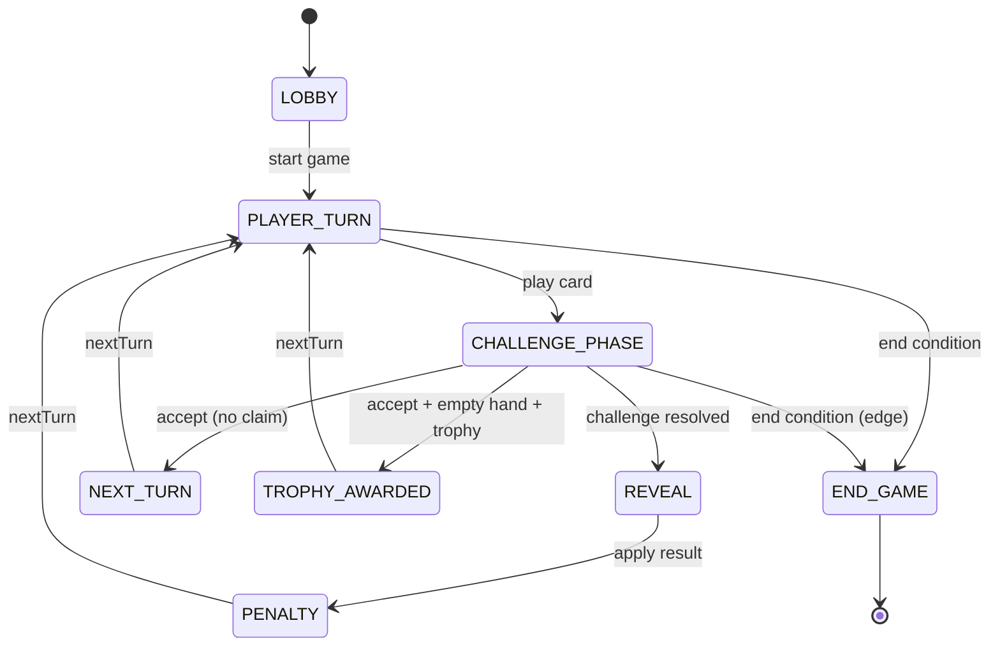

# Wireframes — Sweet & Spicy

Tài liệu mô tả **bố cục khung** (low-fi) bám theo implementation hiện tại. Dùng làm nền cho Figma hoặc bản vẽ chi tiết hơn.

---

## 1. Danh sách màn hình / trạng thái

| ID | Màn / trạng thái | Route / điều kiện |
|----|------------------|-------------------|
| **H1** | Landing (nickname, tạo/join phòng) | `/` — `HomeClient` |
| **R0** | Phòng — lobby | `/room/[code]`, `phase === LOBBY` |
| **R1** | Phòng — lượt chơi (tabletop) | `PLAYER_TURN` + các phase “bàn” (`isTabletopLayoutPhase`) |
| **R2** | Phòng — thách (challenge trên bàn) | `CHALLENGE_PHASE` |
| **R3** | Phòng — lộ bài / hình phạt / trophy / chuyển lượt | `REVEAL`, `PENALTY`, `NEXT_TURN`, `TROPHY_AWARDED` |
| **R4** | Phòng — kết thúc ván | `END_GAME` |
| **O1** | Chat (desktop) | `xl+`: cột phải cố định |
| **O2** | Chat (mobile) | `< xl`: sheet trượt từ đáy |
| **O3** | Video / voice (online) | Block dưới cùng khi `isOnlineMode` |

---

## 2. Wireframe — H1 Landing

```
┌─────────────────────────────────────────────┐
│  [min-h-screen, gradient nền]               │
│                                             │
│           Sweet & Spicy (display title)      │
│           subtitle                           │
│                                             │
│   [Lang VI/EN]  [Theme light/dark]           │
│                                             │
│   ┌─────────────────────────────────────┐   │
│   │  Nickname input                      │   │
│   │  [ Tạo phòng ]                       │   │
│   │  Mã phòng [____] [ Vào phòng ]       │   │
│   └─────────────────────────────────────┘   │
│   (error banner nếu có)                      │
└─────────────────────────────────────────────┘
```

**Ghi chú UX**

- Một cột trung tâm `max-w-md`; CTA chính rõ (tạo vs join).
- Lỗi đăng nhập guest / network gần form.

---

## 3. Wireframe — R0 Lobby (trong phòng)

```
┌──────────────────────────────────────────────────────────────────┐
│ HEADER: [← Thoát]  Tiêu đề phòng   [phase pill]    [chat] [avatars]│
├──────────────────────────────────────────────────────────────────┤
│ MAIN (full width khi chưa xl)                                     │
│  ┌────────────────────────────────────────────────────────────┐  │
│  │ GameTable (lobby): hint text, felt surface                 │  │
│  └────────────────────────────────────────────────────────────┘  │
│                                                                   │
│        Lobby title + Mã phòng (mono)                              │
│        [pill player] [pill player] ...  (ready = green border)    │
│        [ Ready toggle ]  (khi online)                             │
│        [ Add bot ]  [ Start game ]                                │
│                                                                   │
├──────────────────────────────────────────────────────────────────┤
│ FOOTER: PlayerHand (disabled) hoặc vùng đệm                       │
└──────────────────────────────────────────────────────────────────┘
│ ASIDE xl+: ChatPanel (w-80) — hidden mobile                       │
└──────────────────────────────────────────────────────────────────┘
```

---

## 4. Wireframe — R1 Tabletop (lượt đi)

Chia **theo chiều dọc** (mobile-first), **OpponentBar → GameTable → Phase strip → ActionLog → Seat+Hand**.

```
┌──────────────────────────────────────────────────────────────────┐
│ HEADER (như R0)                                                   │
├──────────────────────────────────────────────────────────────────┤
│ OPPONENT BAR: hàng seat đối thủ + highlight lượt                  │
├──────────────────────────────────────────────────────────────────┤
│ GAME TABLE                                                       │
│  [draw pile | supreme]   [trophies chips | locked suit hint]     │
│  [stack table pile]   [last declaration]                         │
│  [optional: center play area]                                    │
├──────────────────────────────────────────────────────────────────┤
│ PHASE STRIP (min-height flex):                                   │
│   "Your turn" / "Waiting for X"                                  │
├──────────────────────────────────────────────────────────────────┤
│ ACTION LOG (có thể collapse trên mobile)                         │
├──────────────────────────────────────────────────────────────────┤
│ LOCAL RAIL                                                       │
│  [PlayerSeat: bạn | score chips]  |  [PlayerHand: scroll ngang]   │
└──────────────────────────────────────────────────────────────────┘
```

**Quy tắc**

- **Bàn** (`GameTable`) chứa metadata ván (draw, supreme, trophy, locked suit).
- **Phase strip** không che bàn; challenge nặng nằm **trên bàn** (R2).

---

## 5. Wireframe — R2 Challenge (inline trên GameTable)

Khi `CHALLENGE_PHASE`, vùng giữa bàn mở rộng chiều cao (`min-h` lớn hơn) để chứa:

```
        ┌─────────────────────────────────────┐
        │  Declaration badge (type + number)   │
        │  Declarer nickname                   │
        │  [ TIMER ring / bar ]                │
        │                                      │
        │  CLAIM_RACE:  [ 🔔 Claim ] [ Accept ]│
        │  PICK_TYPE:   [ Challenge suit ]     │
        │               [ Challenge number ]   │
        └─────────────────────────────────────┘
```

Phase strip phía dưới chỉ còn **hint nhẹ** (“thách trên bàn”) để tránh trùng lặp UI.

---

## 6. Wireframe — R3 Reveal / Penalty / Trophy / Next

- **REVEAL**: component `RevealResult` inline — kết quả + (offline) continue.
- **PENALTY**: copy ai thắng chồng + minh họa stack lá.
- **TROPHY_AWARDED**: icon trophy + copy refill.
- **NEXT_TURN**: một dòng chuyển lượt.

Tất cả nằm trong **cùng vùng phase strip** giữa bàn và ActionLog.

---

## 7. Wireframe — R4 End game

```
        End title + winner name(s)
        ┌─────────────────────────┐
        │ Scoreboard (breakdown)   │
        │ [ Play again ] [ Leave ] │
        └─────────────────────────┘
        [secondary CTA duplicate]
```

`GameTable` ẩn (`phase === END_GAME`).

---

## 8. Wireframe — O2 Mobile chat sheet

```
     … main content …
┌────────────────────────────────────┐
│ Chat title                    [X]  │
├────────────────────────────────────┤
│ messages (scroll)                   │
├────────────────────────────────────┤
│ [ input ] [ send ]                  │
└────────────────────────────────────┘
```

↑ Sheet cố định đáy, bo góc trên, `max-h` khoảng 56vh. Backdrop: blur + tap để đóng.

---

## 9. Wireframe — O3 Video strip (online)

```
┌────────────────────────────────────────────────────────────┐
│ Video title                         [ Connect ]           │
│ ┌──────┐ ┌──────┐ ┌──────┐ ┌──────┐  (grid 2 cols)        │
│ │ self │ │ peer │ │ peer │ │ wait │                       │
│ └──────┘ └──────┘ └──────┘ └──────┘                       │
│        [ mic ] [ cam ] [ hangup ]                          │
└────────────────────────────────────────────────────────────┘
```

Đặt **dưới** `main` để không đẩy mất header; designer có thể đề xuất **thu gọn picture-in-picture** trong tương lai.

---

## 10. Sơ đồ luồng phase (Mermaid)



---

## 11. Responsive breakpoints (chuẩn dùng trong code)

| Token | Ý nghĩa | Ảnh hưởng layout |
|-------|---------|------------------|
| `< 768px` | `isMobileCompact` | ActionLog default collapsed; seat compact; chat sheet |
| `< 1280px` (`xl`) | Chat ẩn sidebar | Chỉ icon message mở sheet |
| `lg` (`1024px`) | `main` flex-row | Chuẩn bị cho sidebar (hiện chat dùng `xl`) |

Designer nên đặt **frame Figma**: 390×844 (mobile), 1440×900 (desktop).

---

## 12. Modal — DeclareDialog

Luồng: chọn lá trên `PlayerHand` → mở dialog → chọn spice + số (bounded by engine) → xác nhận.

```
┌────────────────────────────────────┐
│ Declare                     [x]   │
│ preview lá (optional)              │
│ [ Chili ] [ Pepper ] [ Wasabi ]     │
│ numbers grid / stepper             │
│           [ Cancel ] [ Play ]       │
└────────────────────────────────────┘
```

Z-index cao hơn bàn; focus trap theo Radix Dialog.
