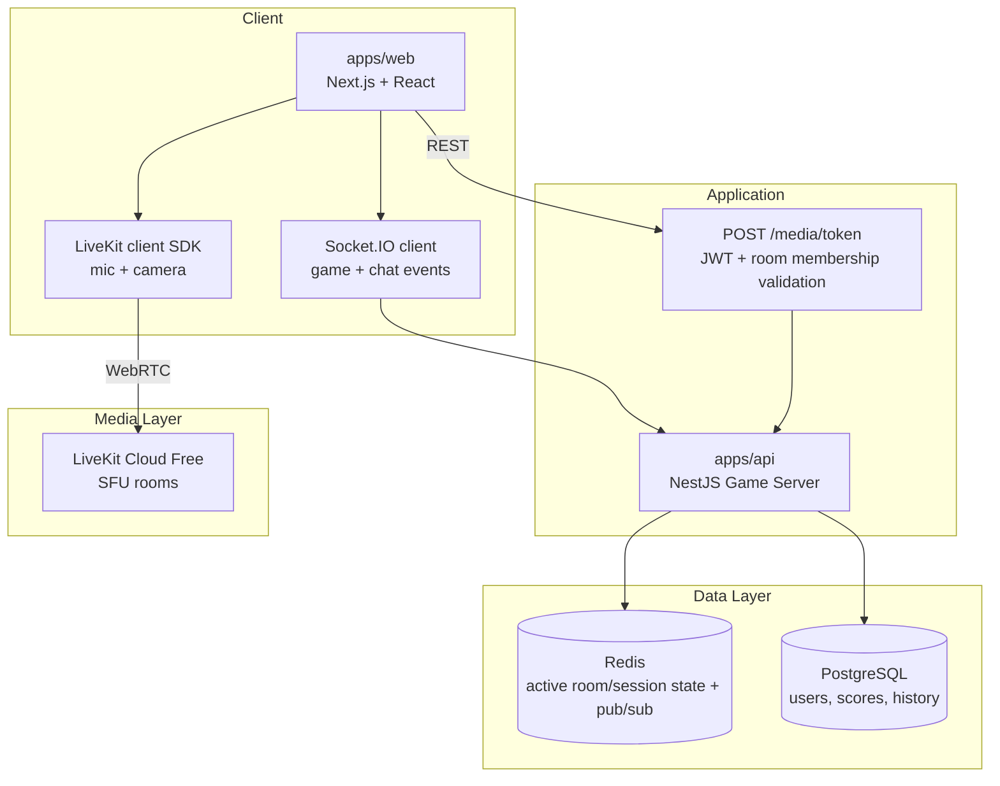

# Technical Design Document: Sweet & Spicy Online Card Game

> Version: 3.0  
> Date: 2026-04-05  
> Status: In implementation

---

## 1. Architecture Overview

### 1.1 Target Topology



### 1.2 Core Principles

1. `apps/api` is the single authoritative server for auth, room membership, gameplay rules, and chat.
2. Media transport is SFU-based via LiveKit Cloud; API only issues access tokens.
3. Redis is the canonical active room/session store and Socket.IO adapter backend.
4. PostgreSQL remains durable storage for users and historical game data.
5. Gameplay/chat correctness must not depend on media connectivity.

---

## 2. Technology Stack

| Layer | Technology | Role |
|---|---|---|
| Monorepo | Turborepo + pnpm workspaces | Shared build graph and shared packages |
| Frontend | Next.js 16 + React 19 + TypeScript | Room UI, gameplay UI, chat UI |
| Realtime gameplay/chat | Socket.IO v4 | Room, game, and chat events |
| Realtime media | LiveKit SDK + LiveKit Cloud Free | Voice/video over SFU |
| Backend | NestJS 10 | REST + Socket.IO gateway + game loop |
| Active state/cache | Redis (self-hosted VM) | Room/session keys, pub/sub, Socket.IO adapter |
| Durable DB | PostgreSQL | Users, scores, history snapshots |
| Shared contracts | `@sweet-spicy/shared-types` | DTOs and Socket.IO event typings |
| Game rules | `@sweet-spicy/game-logic` | Pure, server-authoritative game logic |

---

## 3. Backend Design

### 3.1 Modules

- `auth`: guest login, refresh, JWT guard/strategy.
- `room`: room lifecycle, membership checks, authoritative room/game state operations.
- `realtime`: Socket.IO gateway for room/game/chat events.
- `media`: `POST /media/token` issuance for authenticated room members.
- `redis`: Redis service + Socket.IO Redis adapter wiring.
- `game`: tick loop and bot driver.

### 3.2 Media Token API Contract

`POST /media/token`

Request:

```json
{
  "roomCode": "ABCD"
}
```

Response:

```json
{
  "livekitUrl": "wss://<project>.livekit.cloud",
  "token": "<jwt>",
  "roomCode": "ABCD",
  "participantIdentity": "<userId>",
  "participantName": "<nickname>"
}
```

Rules:

1. Caller must be authenticated (`AuthGuard("jwt")`).
2. Caller must be a current member of the room.
3. Bot users are rejected.
4. LiveKit identity is the app `userId` (single identity source across app + media).

### 3.3 Active State in Redis (Canonical)

Key layout:

- `room:{ROOM_CODE}` -> serialized `ServerRoom`.
- `user-room:{USER_ID}` -> current room code.
- `rooms:active` -> set of active room codes.

TTL policy:

- Waiting room: 24h sliding TTL (refresh on mutation).
- In-progress room: no TTL while active.
- Finished/cancelled snapshot in Redis: 6h TTL.

PostgreSQL remains async durable persistence for room/game history and user-related data.

### 3.4 Socket.IO Scaling Path

- Redis adapter is enabled at bootstrap when Redis is available.
- Single instance still works without adapter.
- Multi-instance readiness: room membership and state are shared via Redis keys + pub/sub adapter.

---

## 4. Client Design (Media)

### 4.1 Media Flow

1. User joins game room via existing auth + Socket.IO flow.
2. Client calls `POST /media/token` with JWT.
3. Client connects to LiveKit room using `livekitUrl` + token.
4. Mic/camera toggles are executed through LiveKit local participant APIs.
5. Remote media state and tracks are derived from LiveKit room/participant events.
6. UI ordering/host badge remains aligned to app room player state by matching LiveKit participant `identity === userId`.

### 4.2 Removed Legacy Protocol

Legacy custom signaling events are removed from shared contract and gateway:

- `webrtc:join-room`
- `webrtc:leave-room`
- `webrtc:update-media-state`
- `webrtc:offer`
- `webrtc:answer`
- `webrtc:ice-candidate`

No parallel app-level media signaling protocol is maintained after LiveKit cutover.

### 4.3 Graceful Disabled State

- If LiveKit is intentionally disabled (`NEXT_PUBLIC_LIVEKIT_ENABLED=false`), media controls are disabled.
- If backend media is not configured (`/media/token` unavailable), UI transitions to disabled state with error feedback.
- Gameplay/chat remain functional in both cases.

---

## 5. Realtime Contracts

### 5.1 Stable Socket Contracts

The following stay on Socket.IO:

- Room lifecycle (`room:*`)
- Gameplay (`game:*`)
- Chat (`chat:*`)

### 5.2 Shared Types Changes

- Added media REST types in `packages/shared-types/src/media.ts`:
  - `MediaTokenRequest`
  - `MediaTokenResponse`
- Removed custom WebRTC signaling/media Socket.IO event types.
- `userId` is the single identity key across:
  - app JWT payload
  - Socket.IO session user
  - LiveKit participant identity
  - room membership records

---

## 6. Infrastructure & Deployment

### 6.1 Environment Variables

API (`apps/api/.env`):

- `DATABASE_URL`
- `JWT_SECRET`
- `PORT`
- `CLIENT_URL`
- `REDIS_URL`
- `LIVEKIT_URL`
- `LIVEKIT_API_KEY`
- `LIVEKIT_API_SECRET`

Web (`apps/web/.env.local`):

- `NEXT_PUBLIC_API_URL`
- `NEXT_PUBLIC_SOCKET_URL`
- `NEXT_PUBLIC_LIVEKIT_ENABLED` (optional, default enabled unless explicitly `false`)

### 6.2 Deployment Decisions

1. Media uses **LiveKit Cloud Free** by default for production/shared/project environments.
2. Redis is **self-hosted on VM** for low-cost project deployment and operational simplicity.
3. No self-hosted LiveKit in default project path.
4. PostgreSQL remains the durable system of record.

### 6.3 Capacity Notes (Project Scope)

- LiveKit Cloud Free should be used until project limits are reached.
- Redis VM sizing can remain small initially (single-node, persistence enabled, restart policy on boot).
- Horizontal API scale is enabled by Redis adapter and shared room/session keys.

---

## 7. Testing Strategy

### 7.1 Backend

- Unit:
  - Media token issuance success/failure by auth/member/bot rules.
  - Redis room repository read/write and TTL behavior.
  - Room leave/rejoin keeps authoritative game state valid.
- Integration:
  - Existing room/game/chat flow still functions after Redis adapter.
  - `POST /media/token` success for valid member; fails for invalid room/non-member/bot.

### 7.2 Frontend

- Media panel disabled state when LiveKit is disabled/unavailable.
- Join/leave/mute/camera toggles reflect LiveKit room state.
- Reconnect path restores media session state without breaking gameplay socket state.

### 7.3 Acceptance

1. Two players can play game and use voice/video in same room.
2. Gameplay/chat continue if media disconnects.
3. Room state survives API restart once Redis-backed canonical state is active.
4. No client/server dependency on `webrtc:*` socket events.

---

## 8. Phased Delivery Plan

### Phase 1: Docs & Contracts

- Update TDD and deployment docs.
- Add shared media token types and config scaffolding.
- Mark legacy signaling as deprecated.

### Phase 2: LiveKit Cutover

- Implement `POST /media/token`.
- Replace custom P2P WebRTC client flow with LiveKit SDK.
- Remove backend signaling relay path.

### Phase 3: Redis State Migration

- Introduce Redis service + Socket.IO adapter.
- Move canonical active room storage from in-memory to Redis.
- Keep PostgreSQL as durable persistence only.

---

## 9. Related Docs

- [LiveKit Cloud setup guide](./livekit-cloud-setup.md)
- [Redis VM deployment runbook](./redis-vm-runbook.md)
- [Legacy WebRTC event removal note](./media-migration-livekit-cutover.md)
